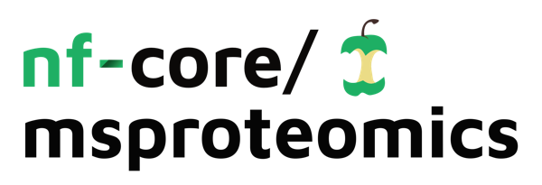

<h1>
  <picture>
    <source media="(prefers-color-scheme: dark)" srcset="docs/images/nf-core-msproteomics_logo_dark.png">
    
  </picture>
</h1>

[](https://github.com/codespaces/new/nf-core/msproteomics)
[](https://github.com/nf-core/msproteomics/actions/workflows/nf-test.yml)
[](https://github.com/nf-core/msproteomics/actions/workflows/linting.yml)[](https://nf-co.re/msproteomics/results)
[](https://www.nf-test.com)

[](https://www.nextflow.io/)
[](https://github.com/nf-core/tools/releases/tag/3.5.2)
[](https://docs.conda.io/en/latest/)
[](https://www.docker.com/)
[](https://sylabs.io/docs/)
[](https://cloud.seqera.io/launch?pipeline=https://github.com/nf-core/msproteomics)

[](https://nfcore.slack.com/channels/msproteomics)[](https://bsky.app/profile/nf-co.re)[](https://mstdn.science/@nf_core)[](https://www.youtube.com/c/nf-core)

## Introduction

**nf-core/msproteomics** is a bioinformatics pipeline for mass spectrometry-based proteomics preprocessing.
It accepts raw instrument data with a CSV samplesheet and produces quantified protein/peptide/ion matrices ready for downstream statistical analysis.
The pipeline supports multiple acquisition strategies through dedicated workflow types:

- **DIA** (Data-Independent Acquisition) -- analyzed with [DIA-NN](https://github.com/vdemichev/DiaNN), with optional MSstats and MaxLFQ quantification
- **DDA LFQ** (Data-Dependent Acquisition, Label-Free Quantification) -- analyzed with the [FragPipe](https://fragpipe.nesvilab.org/) computational platform (MSFragger, MSBooster, Percolator, IonQuant)
- **TMT Label Check** -- TMT labeling efficiency QC using FragPipe search followed by label incorporation analysis
- **Generic FragPipe** -- fully configurable FragPipe workflows driven by `.workflow` files

Instrument-specific settings are applied via optional config files (`-c conf/instruments/*.config`).

## Analysis Modes

The `--mode` parameter selects the analysis engine.
FragPipe sub-modes are controlled with `--tmt_mode` for TMT workflows.

| Mode | Sub-mode | Description | Engine |
| --- | --- | --- | --- |
| `diann` | -- | DIA quantitative proteomics (standard, phospho) | [DIA-NN](https://github.com/vdemichev/DiaNN) |
| `fragpipe` | *(none)* | Generic FragPipe workflows, configured by [workflow files](https://github.com/Nesvilab/FragPipe/tree/develop/workflows) | [FragPipe](https://fragpipe.nesvilab.org/) |
| `fragpipe` | `--tmt_mode labelcheck` | TMT labeling efficiency QC | [FragPipe](https://fragpipe.nesvilab.org/) |
| `fragpipe` | `--tmt_mode quant` | TMT isobaric quantification | [FragPipe](https://fragpipe.nesvilab.org/) |

DIA method variants (e.g., phospho) and instrument-specific settings are applied via `-c` config files.
See [docs/usage.md](docs/usage.md) for full details.

## Usage

> [!NOTE]
> If you are new to Nextflow and nf-core, please refer to [this page](https://nf-co.re/docs/usage/installation) on how to set-up Nextflow.
> Make sure to [test your setup](https://nf-co.re/docs/usage/introduction#how-to-run-a-pipeline) with `-profile test` before running the workflow on actual data.

First, prepare a CSV samplesheet describing your samples:

```csv
sample,spectra
Sample1,/path/to/sample1.raw
Sample2,/path/to/sample2.raw
Sample3,/path/to/sample3.raw
```

Optional columns: `condition` (experimental group), `label` (TMT channel, e.g. TMT126), `fraction` (fraction number). If present, these are parsed automatically.

Then run the pipeline:

```bash
# DIA analysis
nextflow run nf-core/msproteomics \
  --mode diann \
  --input samplesheet.csv \
  --database /path/to/database.fasta \
  --outdir results \
  -profile docker

# FragPipe DDA LFQ analysis
nextflow run nf-core/msproteomics \
  --mode fragpipe \
  --fragpipe_container your-registry/fragpipe:24.0 \
  --fragpipe_workflow LFQ-MBR.workflow \
  --input samplesheet.csv \
  --database /path/to/uniprot_human.fasta \
  --outdir results \
  -profile docker

# TMT label check (TMT18 example)
nextflow run nf-core/msproteomics \
  --mode fragpipe \
  --fragpipe_container your-registry/fragpipe:24.0 \
  --tmt_mode labelcheck \
  --tmt_type TMT18 \
  --input samplesheet.csv \
  --database /path/to/uniprot_human.fasta \
  --outdir results \
  -profile docker

# TMT quantification (TMT18 example)
nextflow run nf-core/msproteomics \
  --mode fragpipe \
  --fragpipe_container your-registry/fragpipe:24.0 \
  --tmt_mode quant \
  --tmt_type TMT18 \
  --fragpipe_workflow /path/to/TMT-quant.workflow \
  --input samplesheet.csv \
  --database /path/to/uniprot_human.fasta \
  --outdir results \
  -profile docker
```

> [!WARNING]
> Please provide pipeline parameters via the CLI or Nextflow `-params-file` option.
> Custom config files including those provided by the `-c` Nextflow option can be used to provide any configuration _**except for parameters**_; see [docs](https://nf-co.re/docs/usage/getting_started/configuration#custom-configuration-files).

For more details and further functionality, please refer to the [usage documentation](docs/usage.md) and the [parameter documentation](https://nf-co.re/msproteomics/parameters).

## Pipeline Output

To see the results of an example test run with a full size dataset refer to the [results](https://nf-co.re/msproteomics/results) tab on the nf-core website pipeline page.
For more details about the output files and reports, please refer to the [output documentation](docs/output.md).

## FragPipe License

FragPipe-based workflows (DDA LFQ, TMT Label Check, generic FragPipe) require a [FragPipe](https://fragpipe.nesvilab.org/) installation with a valid license.
FragPipe is free for academic use; commercial users must obtain a license from the University of Michigan.
You must build or provide a Docker/Singularity container that includes FragPipe, MSFragger, IonQuant, and Philosopher under your own license terms.

## Documentation

- [Usage guide](docs/usage.md) -- full parameter reference and workflow examples
- [Output documentation](docs/output.md) -- description of pipeline output files and reports
- [Module documentation](docs/modules/README.md) -- per-module reference for all local modules
- [Docker build instructions](docs/fragpipe-docker/README.md) -- building the FragPipe container image

## Credits

The pipeline was originally created by [Dongze He](https://github.com/DongzeHE) and is maintained and developed by [Dongze He](https://github.com/DongzeHE) and [Fengchao Yu](https://github.com/fcyu).

The DIA-NN workflow is inherited from [quantms](https://github.com/bigbio/quantms), developed by the [bigbio](https://github.com/bigbio) community.

The advisory team includes Dr. Stefka Tyanova (Altos Labs), Dr. Daniel Itzhak (Altos Labs), Dr. Felix Krueger (Altos Labs), and [Dr. Alexey I. Nesvizhskii](https://medschool.umich.edu/profile/3401/alexey-nesvizhskii) (University of Michigan Medical School).

## Contributions and Support

If you would like to contribute to this pipeline, please see the [contributing guidelines](.github/CONTRIBUTING.md).

For further information or help, don't hesitate to get in touch on the [Slack `#msproteomics` channel](https://nfcore.slack.com/channels/msproteomics) (you can join with [this invite](https://nf-co.re/join/slack)).

## Citations

If you use nf-core/msproteomics for your analysis, please cite it using the nf-core publication and the underlying tools.

### Underlying Tools

Please cite the tools used by this pipeline depending on the workflow you run:

**FragPipe** (DDA LFQ, TMT workflows):
See the full list of key references at [FragPipe GitHub](https://github.com/Nesvilab/FragPipe#key-references), including MSFragger, Philosopher, IonQuant, and TMT-Integrator.

**DIA-NN** (DIA workflows):
See the key publications at [DIA-NN GitHub](https://github.com/vdemichev/diann#key-publications).

An extensive list of references for all tools used by the pipeline can be found in the [`CITATIONS.md`](CITATIONS.md) file.

### nf-core

You can cite the `nf-core` publication as follows:

> **The nf-core framework for community-curated bioinformatics pipelines.**
>
> Philip Ewels, Alexander Peltzer, Sven Fillinger, Harshil Patel, Johannes Alneberg, Andreas Wilm, Maxime Ulysse Garcia, Paolo Di Tommaso & Sven Nahnsen.
>
> _Nat Biotechnol._ 2020 Feb 13. doi: [10.1038/s41587-020-0439-x](https://dx.doi.org/10.1038/s41587-020-0439-x).
